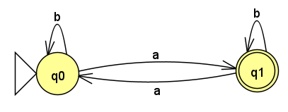

## Nomor 1

Pilih $w = a^kb^{k+1}$, terus manfaatin closure reversi

## Nomor 2

Pilih $w = a^{2k}ba^k$, ambil $q = 2$.

## Nomor 3

$w = a^kba^k$, ambil $q = 2$.

## Nomor 4

 Diberikan sebuah bahasa $L$, yaitu $\{w \in \{a, b\}^* : \text{jika } \#_a(w) \text{ bilangan ganjil, maka } \#_a(w)< 2 \#_b(w) \}$.

Berdasarkan ekuivalensi preposisi, bahasa $L$ dapat ditulis sebagai berikut.
$$
\begin{align*}
L &= \{w \in \{a, b\}^* : \#_a(w) \text{ bilangan genap} \or \#_a(w)< 2 \#_b(w) \}\\
&= \{w \in \{a, b\}^* : \#_a(w) \text{ bilangan genap}\} \cup \{w \in \{a, b\}^* : \#_a(w)< 2 \#_b(w) \}\\
&= K \cup M
\end{align*}
$$
Asumsikan bahasa $L$ merupakan bahasa reguler. Jelas bahwa bahasa $K$, dapat kita buat DFSM nya, yaitu sebagai berikut.

Dapat disimpulkan $K$ merupakan bahasa reguler. Selanjutnya perhatikan bahwa bahasa reguler memiliki sifat tertutup terhadap operasi *union*. Sehingga apabila $K$ dan $L$ merupakan bahasa reguler, maka $M$ juga merupakan bahasa reguler. Akan dibuktikan bahwa $M$ bukan merupakan bahasa reguler dengan teorema Pumping.

Berdasarkan teorema pumping, anggap $k$ sebagai *pumping length*, ambil sebuah string $w = a^{2k}b^{k+1} \in L$, jelas bahwa $|w| = 3k + 1$, dan $\#_a(w)< 2 \#_b(w) \iff 2k < 2(k+1) \iff 2k < 2k + 2$. Selanjutnya, partisi dari string tersebut dapat dibuat:

- $w = xyz$, dengan $|xy| \leq k$ 
- $x = a^i; y = a^j; z = a^{2k-i-j}b^{k+1}$, dengan $1 \leq i+j \leq k$ dan $1 \leq j$.

Selanjutnya untuk string dalam bentuk $xy^qz = a^ia^{jq}a^{2k-i-j}b^{k+1} = a^{2k+j(q-1)}b^{k+1}$. Akan dipilih $q = 3$, maka dapat ditulis $a^{2k+2j}b^{k+1}$, perhatikan bahwa $j \geq 1 \iff 2j \geq 2 \iff 2k+2j \geq 2(k+1)$. Maka, dapat kita tuliskan $\#_a(w)< 2 \#_b(w)$ sebagai $2k+2j < 2(k+1)$, yang berkontradiksi dengan persamaan di atas. Sehingga terbukti, bahwa $L$ bukan merupakan bahasa regular. 

## Nomor 5

Ambil $w = a^kc^k$, ambil $q = 0$.

## Nomor 6

ambil $w = a^kb^{2k+3}$, ambil $q = 0$.

## Nomor 7

Ambil $w = a^ic^k$, ambil $q = 2$.

## Nomor 8

### Review

Izin bertanya untuk soal nomor 8 tertulis bahwa bahasa tersebut akan menerima

$\{vw : v^R \text{ adalah suffix dari } w \text{ dengan } w \in \{a,b\}^*\}$

Apakah dalam kasus ini $|v| > 0$? karena berdasarkan definisi dari slide bahwa string v merupakan string kosong maka reversenya yang sama dengan string kosong juga, akan menjadi suffix dari semua string (katakan itu string w) dan pada dasarnya bahasa tersebut jelas reguler.

$L = \{vw:v^R \text{ suffix dari }w; w \in \{a,b\}^*\}$.

Definisikan sebuah string disebut *fixed beforehand*, artinya untuk setiap bahasa di string tersebut, $w$ bernilai sama.

Terdapat dua asumsi dalam pengerjaan soal ini.

#### Asumsi Pertama

String $w$ tidak *fixed beforehand*. Jelas, bahwa setiap string dapat dinyatakan dalam $vw$, dengan $v = \varepsilon$. Selanjutnya, perhatikan bahwa $v^R = \varepsilon$ berdasarkan definisi di slide, pasti merupakan suffix dari semua string. Sehingga, jelas bahwa bahasa tersebut reguler, dengan DFSM yang menerima $\{a,b\}^*$ dan trivial.

#### Asumsi Kedua

Asumsi kedua, string $w$ *fixed beforehand*. Kita akan membuktikan bahwa bahasa ini merupakan bahasa non-reguler dengan pumping theorem. Asumsikan bahasa $L$ tersebut merupakan bahasa reguler. Definisikan $k$ sebagai *pumping length*.

Kita pilih, sebuah string $w' = a^kba^k$ dengan $v = a^k$ dan $w = ba^k$. Secara trivial, $v^R$ merupakan suffix dari $w$.   Kemudian, akan dipartisi string $w' = xy^qz$ dengan detail sebagai berikut,

- $x = a^i; y = a^j; z^{k-i-j}ba^k$, dengan $1 \leq i + j \leq k$, dan $j \geq 1$.
- Kita pilih, $q = 2$, maka $xy^2z = a^ia^{2j}a^{k-i-j}ba^k = a^{k+j}ba^k$.
- Karena $j \geq 1$, maka $v = a^{k+j} = v^R$, dan bukan merupakan suffix dari $w = ba^k$. Sehingga $xy^2z \notin L$.

Berdasarkan teorema pumping, hal ini berkontradiksi dengan asumsi bahwa $L$ merupakan bahasa regular. Sehingga, terbukti bahwa $L$ merupakan bahasa non-regular

## Nomor 8

$L = \{vw:(w \in \{a,b\}^*) \and (v^R \text{ suffix dari }w)  \and(2|v| \geq |w|)\}$.

Akan dibuktikan bahwa bahasa $L$ merupakan bahasa non regular menggunakan *pumping theorem*. Asumsikan $L$ merupakan bahasa reguler, dan $k$ merupakan *pumping length*.

Pilih suatu string $s = a^kba^k = a^kba^k$. Perhatikan bahwa pada string ini, salah satu cara untuk mempartisi string menjadi $vw$ ialah $v = a^k$ dan $w = ba^{k}$. Hal ini valid karena $2|v| \geq |w| \iff 2k \geq k+1$ untuk $k > 0$. String $s$ tersebut dapat dipartisi menjadi:

- $x = a^i, y = a^j, z = a^{k-i-j}ba^k$, dengan $1 \leq i + j \leq k$ dan $j \geq 1$.
- Berdasarkan teorema pumping, setiap $q \geq 0$ berlaku $xy^qz \in L$. Pilih $q = k + 1$.
- Maka $xy^{k+1}z = a^ia^{(k+1)j}a^{k-i-j}ba^k = a^{k(j+1)}ba^k$.

Akan dibuktikan bahwa tidak ada partisi $v$ dan $w$ sehingga string  $xy^{k+1}z$ tersebut merupakan anggota bahasa $L$.

**Bukti**.

**Kasus 1**: Coba partisi $v = a^x$, dengan $x > k$, maka jelas $v^R$ yang panjangnya $>k$ tidak dapat menjadi suffix string $w$ yang secara trivial diketahui memiliki suffix $ba^k$.

**Kasus 2**: Coba partisi $v = a^{k(j+1)}ba^x$, dengan $x \geq 0$, maka jelas $v^R$ yang panjangnya $> k$ tidak dapat menjadi suffix string $w$ yang kini panjangnya $\leq k$.

**Kasus 3**: Coba partisi $v = a^x$, dengan $x \leq k$. 

- $|v| = x$.
- $|w| = k(j+1)-x+1+k = k(j+2) + 1 - x$.
- Karena $j \geq 1$, maka $|w| = k(j+2) + 2 \geq 3k + 2$.
- Dapat ditulis $2|v| = 2x \leq 2k < (3k + 2) \leq |w| \iff 2|v| < w$. Hal ini berkontradiksi dengan syarat bahasa ini anggota dari bahasa $L$.

Sehingga, terbukti bahwa $xy^{k+1}z \notin L$. Sehingga berdasarkan *pumping theorem*, dapat disimpulkan $L$ merupakan bahasa non-regular.

