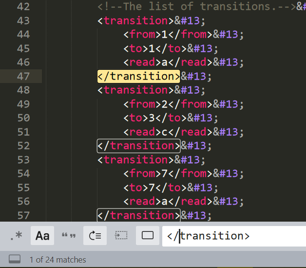
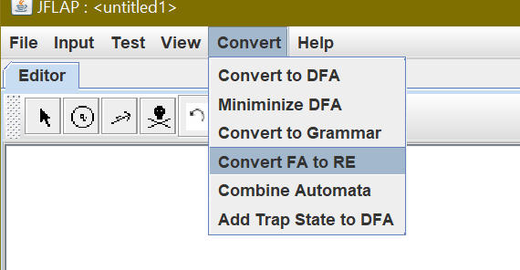
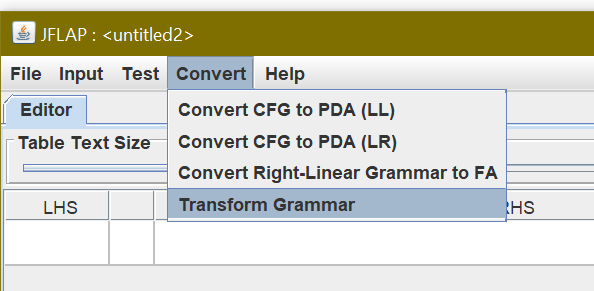
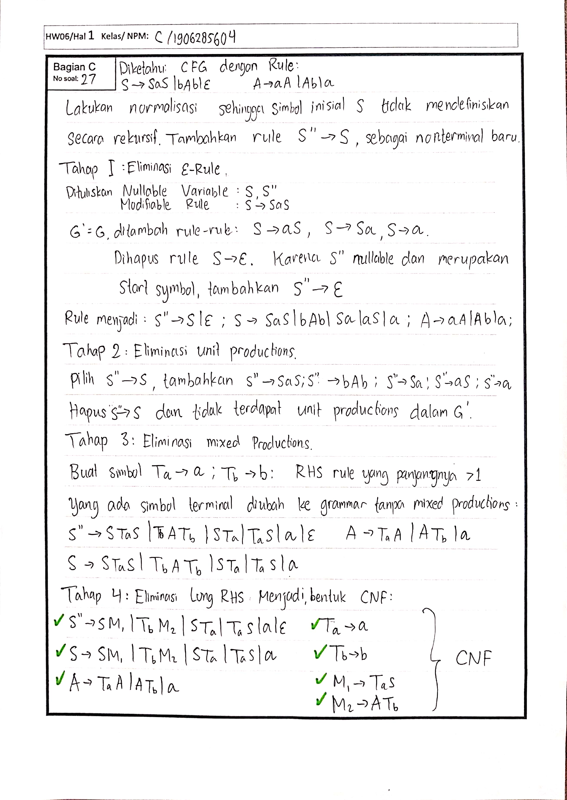

# Theory of Computation Tools

Credits:

- Fausta
- Hocky

### Table of Contents

<!-- MarkdownTOC -->

- [1A. Top 10 Proper Order](#1a-top-10-proper-order)
- [1B. Pembuktian](#1b-pembuktian)
- [2A. Membuat DFSM](#2a-membuat-dfsm)
- [2B. Membuat NDFSM](#2b-membuat-ndfsm)
- [3A. NDFSM -> DFSM](#3a-ndfsm---dfsm)
- [3B. Minimalisasi DFSM](#3b-minimalisasi-dfsm)
- [3C. Kelas Ekivalen](#3c-kelas-ekivalen)
- [4A. Membuat Regex](#4a-membuat-regex)
- [4B. Regex -> NDFSM](#4b-regex---ndfsm)
- [4C. FSM -> Regex](#4c-fsm---regex)
- [4D. Membuat DFSM dari gabungan beberapa mesin](#4d-membuat-dfsm-dari-gabungan-beberapa-mesin)
- [5A. Pumping](#5a-pumping)
- [6A. Regular Grammar](#6a-regular-grammar)
- [6B. CFG](#6b-cfg)
- [6C. CFG -> Chomsky](#6c-cfg---chomsky)

<!-- /MarkdownTOC -->

### 1A. Top 10 Proper Order

[Program 1A](./Kode/1A.cpp)

Cara pakai:

- Ubah fungsi `bool isValid(const string &S);` biar sesuai dengan syarat, bisa pakai fungsi match kalau mau.
- Ubah domain dan letakkan ke `vector <isi>`, bisa pakai `  vector <string> isi = kleene({"a", "b"}, STAR);` Untuk kleene star berapa string pun, bisa juga `kleene({"hock", "yy"}, STAR)`.

### 1B. Pembuktian

Baca-baca materi ini, jangan lupa baca contoh pembuktian juga.

- https://scele.cs.ui.ac.id/pluginfile.php/101649/mod_resource/content/1/HW2101%20v5%20Solusi%20Bag%20B.pdf
- https://cs.lmu.edu/~ray/notes/languagetheory/

### 2A. Membuat DFSM

[Program 2A](./Kode/2A.cpp)

Cara pakai:

- Karakter domainnya ditahan agar jangan kebanyakan, 7-10 mestinya udah cukup
- Modif fungsi `ll cek(string s)` agar menerima string yang diinginkan.
- 
- Jangan lupa mengecek JFF menggunakan text editor, apakah matches nya ada banyak karakter * banyak state dan pastikan kalau dia DFSM. **Jangan lupa menambahkan transisi dari dead state ke dead state juga.**

### 2B. Membuat NDFSM

Coba-coba aja sendiri, baca-baca latihan

### 3A. NDFSM -> DFSM

[Program 3A](./Kode/3A.cpp)

Tinggal modif aja `void makeEdge()`, terus dia bakal otomatis ngerubah. Ini cuma buat essay ya! Kalau mau JFF tinggal pake JFLAP langsung.

### 3B. Minimalisasi DFSM

[Program 3B](./Kode/3B.cpp)

Tinggal modif aja `void makeEdge()`, terus dia bakal otomatis ngerubah. Ini cuma buat essay ya! Kalau mau JFF tinggal pake JFLAP langsung.

### 3C. Kelas Ekivalen

[Program 3C Fausta](./Kode/3C.cpp)

[Program 3C Hocky](./Kode/3Cv2.cpp)

Refer ke 2A, penggunaannya sama.

### 4A. Membuat Regex

Pikirin dulu benar-benar langsung aja buat regexnya. Kalau udh stuck banget baru:

- Pake program 2A, terus bikin FSMnya, terus bisa convert



### 4B. Regex -> NDFSM

Sama aja pake JFLAP.

### 4C. FSM -> Regex

[Program 4C Hocky](./Kode/4C.cpp)

Use `regex.cpp`. Modify:

```c++
void makeEdges();
```

Here is the sample interaction. You can enter each query as `rip <Node>` or `print`, don't rip the last nodes. Please make sure the automata you build at first is already prenormalized with:

- No-self loop Initial Node
- Only one accepting nodes

**First input**

```
rip D
```
```
Ripping D
Old Affected Transitions: 
Self loop: ((D, a+b), D)
((B, a), D)
((D, b), C)
((D, ε), G)
New Transitions: 
((B, a(a+b)*b), C)
((B, a(a+b)*), G)
```
**Second input**

```
print
```
```
((A, b), A)
((A, ε), B)
((A, ε), C)
((B, a), B)
((B, a(a+b)*b), C)
((B, a(a+b)*), G)
((C, b), C)
((C, a), E)
((E, ε), C)
((E, ε), G)
((F, ε), A)
```

### 4D. Membuat DFSM dari gabungan beberapa mesin

- A - B = A ∩ B<sup>c</sup> =  (A<sup>c</sup> ∪ B)<sup>c</sup>
- A ∩ B = (A<sup>c</sup> ∪ B<sup>c</sup>)<sup>c</sup>

Cara bikin A ∪ B:

- Pertama tambahin satu node Initial, terus dari dua mesin itu inisial yang baru dibikin dihubungin pake ε ke inisial mesin A, sama mesin B

Cara bikin A<sup>c</sup>:

- Convert ke DFSM
- Minimalize DFSM
- **PASTIKAN BENAR BENAR LENGKAP DFSM-NYA!** Semua karakter harus ada, semua transisi harus ada untuk semua karakter.
- Swap final dan non-final

Cara bikin concat(A, B):

- Bikin initial B yang baru, bikin ending nodes satu yang baru dari A, gabungin A -> B, hapus tanda final nodes dari A.

Cara bikin A<sup>R</sup>:

- Convert ke DFSM
- **PASTIKAN BENAR BENAR LENGKAP DFSM-NYA!** Semua karakter harus ada, semua transisi harus ada untuk semua karakter.
- Accepting harus satu, kalau lebih dari satu finalnya bikin node baru.
- Initial jadi accepting, accepting jadi initial
- Reverse semua arah transisinya
- Hasilnya bisa jadi NDFSM
- Convert lagi ke DFSM bila perlu.

Cara bikin A<sup>*</sup>:

- Bikin satu initial state, untuk setiap accepting state bikin transisi ε ke initial.

Referensi:

- https://www.youtube.com/watch?v=em-lZgQeDlI
- https://www.geeksforgeeks.org/reversal-process-in-dfa/

### 5A. Pumping

Misalkan sebuah pumping length $k$, pilih sebuah string $w$, yang panjangnya $\geq k$, biasanya panjangnya ada variabel $k$-nya. Partisi $w$ jadi $xyz$, dengan $|xy| \leq k$ dan $|y| \geq 1$, pilih sembarang $q$ sehingga $xy^qz \notin L$. $q$ biasanya $1, 2,$ atau $k$.

Referensi:

- https://www.youtube.com/watch?v=I3FuVKVgLCA

### 6A. Regular Grammar

[Program 6A](./Kode/6A.cpp)

Refer ke 2A, penggunaannya sama.

### 6B. CFG

Baca latihan-latihan.

### 6C. CFG -> Chomsky

Pake JFLAP



Untuk tambahan silakan baca [CFGtoNormalForm](./HW/HW2106/CFGtoNormalForm.pdf).

Ada beberapa steps selain yang utama:

- Nonproductive Removal, artinya semua terminal yang tidak bisa menuju non terminal bisa dibuang.
- Semua terminal yang tidak bisa diraih dari inital juga mesti dibuang.
- Unit removal, semua rule A -> B, bisa diganti dengan A -> C, dengan B -> C benar
- Epsilon Removal, semua rule A -> ε bisa dibuang dan semua B -> A

